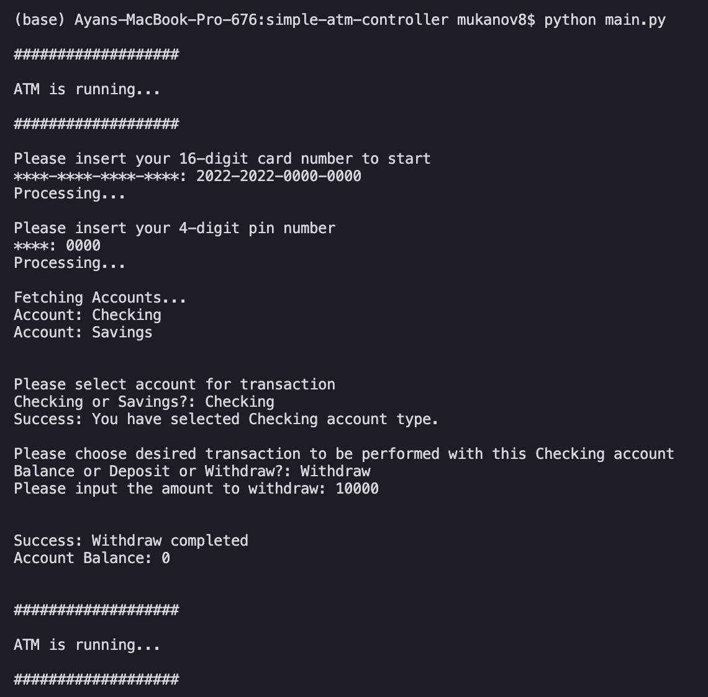
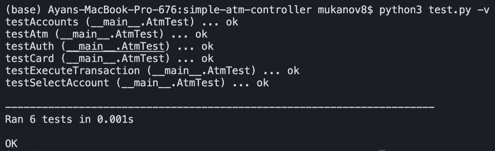

# Simple ATM Controller

Implementation of a simple atm controller for Bear Robotics OA, February 2022

## Available operations

> Insert Card => PIN number => Select Account => See Balance/Deposit/Withdraw

## How To Run

Clone the project using

```shell
git clone https://github.com/mukanov8/simple-atm-controller.git
```

Make sure you have python installed on your machine (I am using python 3.10.2). You can check you python version using following command

```shell
python --version 
```

To run ATM, run following in the project directory

```shell
python main.py
```

To test, run following in the project directory

```shell
python test.py
```

or

```shell
python test.py -v
```

## Details

- Initially, the ATM holds 30000$, defined as  `INITIAL_AVAILABLE_AMOUNT` constant in the `constant.py` file.
- Any Withdraw operation for more than that amount or amount being held on the selected account will raise a withdraw error.

- Account, Transaction, and Status constant types are defined separately in a `contant.py` file.

  ```py
  Account = {
      'CHECKING': 'Checking',
      'SAVINGS': 'Savings',
  }

  Transaction = {
      'DEPOSIT': 'Deposit',
      'WITHDRAW': 'Withdraw',
      'BALANCE': 'Balance',
  }

  Status = {
      'ERROR': 'Error',
      'SUCCESS': 'Success',
  }
  ```

- ATM utilizes mock card&account information, defined as a `mockBankDb` in `Bank(bank.py)`

  ```py
  mockBankDb = {
      '2022-2022-0000-0000': {
          'pin': '0000',
          'accounts': {
              Account['CHECKING']: {
                  'balance': 10000,
              },
              Account['SAVINGS']: {
                  'balance': 20000,
              },
          },
      },
      '2022-2022-0000-0001': {
          'pin': '0001',
          'accounts': {
              Account['CHECKING']: {
                  'balance': 20000,
              },
              Account['SAVINGS']: {
                  'balance': 40000,
              },
          },
      },
      '2022-2022-0000-0002': {
          'pin': '0002',
          'accounts': {
              Account['CHECKING']: {
                  'balance': 30000,
              },
              Account['SAVINGS']: {
                  'balance': 50000,
              },
          },
      },
  }
  ```

## Demo

>### ATM



>### Test


